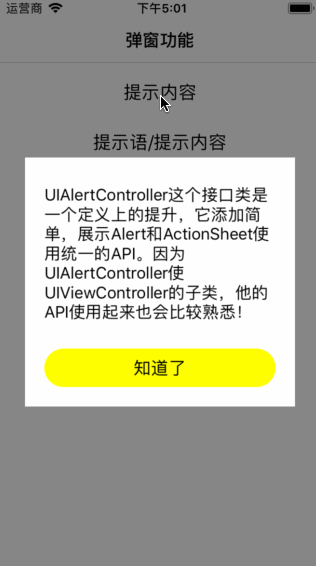

# SYAlertView
自定义弹窗子视图UI
根据UI设计需求，自定义各种样式的弹窗子视图：
* 自定义UI及样式
* 自定义显示动画
* 编辑控件自适应键盘高度

#### 效果图



#### 代码示例

1、导入头文件
```
#import "SYAlertView.h"
```

2、实例化
```
SYAlertView *alertView = [[SYAlertView alloc] init];
alertView.isAnimation = YES;
alertView.originSpace = 20.0f;
```

3、子视图设置
```
// 自定义的子视图
UIView *view = [[UIView alloc] initWithFrame:CGRectMake(0.0, 0.0, 200.0f, 110.0f)];
UILabel *message = [[UILabel alloc] initWithFrame:CGRectMake(20.0f, 20.0f, 160.0f, 40.0f)];
message.text = @"弹窗信息";
[view addSubview:message];
UIButton *button = [[UIButton alloc] initWithFrame:CGRectMake(20.0f, 70.0f, 160.0f, 30.0f)];
[button setTitle:@"知道了" forState:UIControlStateNormal];
[button addTarget:self action:@selector(closeClick:) forControlEvents:UIControlEventTouchUpInside]
[view addSubview:button];
```

方法1
```
alertView.showContainerView = view;
```

方法2
```
alertView.containerView.frame = CGRectMake(20.0f, (alertView.frame.size.height - view.frame.size.height) / 2, view.frame.size.width, view.frame.size.height);
[alertView.containerView addSubview:view];
```

4、方法调用

显示
```
[alertView show];
```

隐藏
```
[alertView hide];
```

#### 修改说明
* 20180724
  * 版本号：1.0.3
  * 优化完善
    * 添加属性`originSpace`设置编辑视图与键盘间距
    * 结束编辑后，视图恢复原点位置
    * 切换编辑视图时，位置改变
    
* 20180718
  * 版本号：1.0.2
  * 修改文档说明
  
* 20180717
  * 版本号：1.0.2
  * 修改异常：设置属性showContainerView时，默认居中
  
* 20180608
  * 版本号：1.0.1
  * 功能完善
    * 编辑控件时，自适应键盘高度避免被键盘遮挡
    * 自定义显示动画
    
* 20180605
  * 版本号：1.0.0
  * 添加源码
